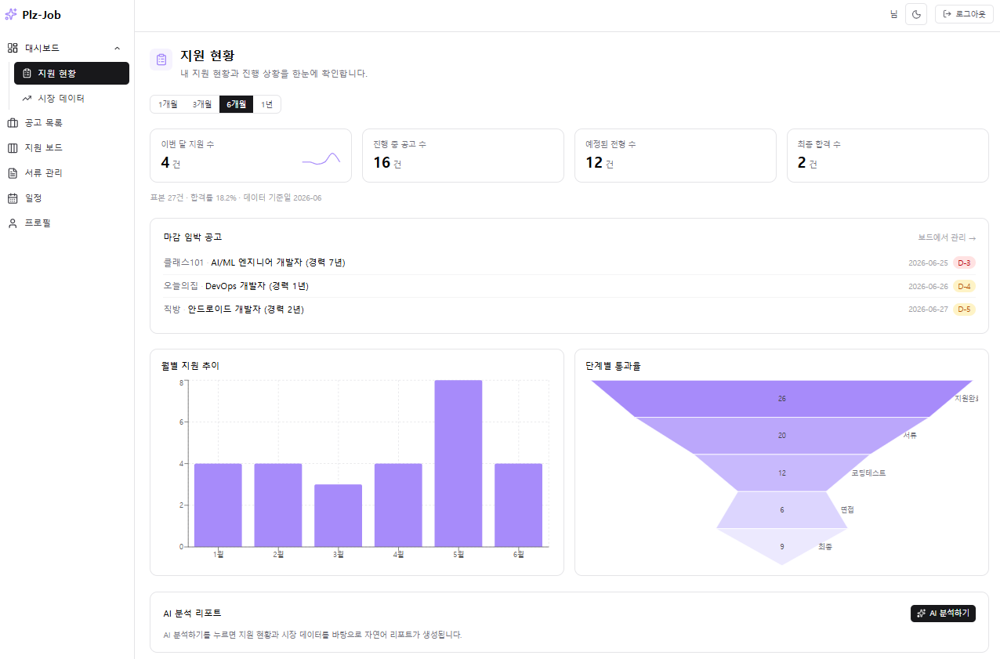
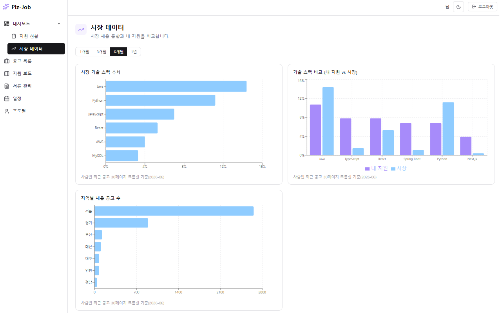
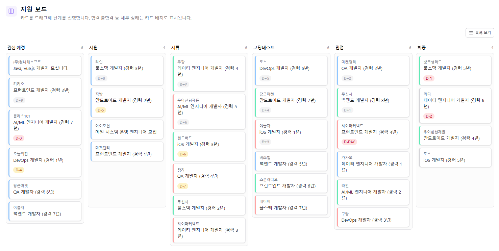

# Plz-Job\_**개발자 취준생&이직러 취업 지원 기록 및 데이터 분석 플랫폼**

> PKNU 2026 '빅데이터를 활용한 자바 개발자 과정' 2차 프로젝트

여러 채용 사이트에 흩어진 공고·지원 서류·전형 단계·일정·회고를 한곳에서 관리하고,</br>
사람인 채용 데이터를 크롤링·집계해 **시장 동향과 내 지원 활동을 비교**하며,</br>
로컬 LLM(Ollama)으로 **예상 면접 질문**과 **대시보드 분석 리포트**를 생성한다.

## 핵심 기능

| 영역           | 내용                                                                                              |
| -------------- | ------------------------------------------------------------------------------------------------- |
| 인증           | 카카오·구글 **소셜 로그인 전용**(비밀번호 미저장), JWT HttpOnly 쿠키, 사용자별 데이터 소유권 검증 |
| 공고·지원      | URL 자동 입력(파싱) + 수동 보정, 공고 CRUD, **13단계** 지원 상태 변경과 변경 이력                 |
| 서류           | 이력서·자소서 PDF/TXT 업로드, 버전 관리, 텍스트 추출, 공고별 제출 문서 연결                       |
| 일정·회고      | 전형 일정(마감/코테/면접) 등록·캘린더 조회, 코테/면접 회고 기록                                   |
| 대시보드(개인) | 월별 지원 추이, 단계별 전환율(퍼널), 합격률 등 KPI                                                |
| 시장 분석      | 기술 스택 추세, 지역별 공고 분포, 개인 vs 시장 비교                                               |
| AI(로컬 LLM)   | 공고+서류 기반 예상 면접 질문·꼬리질문, 집계값 기반 자연어 리포트                                 |

- 메인 화면
  

- 시장 데이터 분석
  

- 지원 보드 관리
  

- 일정 관리
  

## 기술 스택

- **Front-End**: React + JavaScript (Vite)
- **Back-End**: Spring Boot / Spring Security · Oracle
- **데이터 분석/ETL**: Python · Pandas · BeautifulSoup · Hadoop HDFS(원본 적재) · oracledb(집계 적재)
- **로컬 AI**: Ollama 기반 로컬 LLM
- **외부 데이터**: 사람인(saramin.co.kr) 채용 공고 정적 크롤링

## 아키텍처 / 데이터 흐름

개인 도메인과 시장·분석 데이터가 **하나의 Oracle 스키마**에 공존하며, 시장 데이터는
ETL이 적재하고 백엔드는 읽기 전용으로 조회한다.

```
React (Vite, /api → :8080 프록시)
   │  REST API (개인 도메인 + 시장/대시보드 조회)
Spring Boot ── Oracle ── Ollama (질문·리포트 생성)
   ▲              ▲
   │ 읽기 전용     │ 적재
   └────── analytics_* / market_* / etl_runs
                  ▲
Python ETL(독립 실행): 사람인 크롤링 → 태깅(스택/지역/직무) → 마감 필터 → 집계
   → HDFS 원본 적재 + Oracle 집계 적재
```

> 데이터 흐름: **ETL → Oracle `analytics_*` → Spring Boot `/api/market/*` → React**.
> (ETL은 `frontend/src/mocks/data/market.json`도 함께 export하지만, 이는 백엔드 없이
> 프론트를 단독 구동할 때 쓰는 MSW용 오프라인 산출물이며 현행 앱에서는 사용하지 않는다.)

## 모듈 구조

```
plz-job/
├── backend/    Spring Boot REST API (인증·공고·지원·문서·일정·회고·AI·대시보드/시장 조회)
├── frontend/   React + Vite SPA (대시보드 차트·공고/서류/회고 CRUD·AI 화면)
├── etl/        Python ETL (사람인 크롤링 → 태깅 → 집계 → HDFS/Oracle 적재)
├── db/         Oracle 스키마 DDL(schema.sql) + 화면 확인용 시드(seed_job_postings.sql)
├── docs/       요구사항·API·DB 설계 문서
├── docker-compose.yml   Oracle + Ollama 로컬 인프라
└── .env
```

## 문서

| 문서                                                         | 내용                             |
| ------------------------------------------------------------ | -------------------------------- |
| [docs/plz_job_requirements.md](docs/plz_job_requirements.md) | 요구사항 정의서 (단일 기준 문서) |
| [docs/API\_명세서.md](docs/API_명세서.md)                    | REST API 명세 (엔드포인트 41종)  |
| [docs/DB\_설계서.md](docs/DB_설계서.md)                      | 물리 데이터 모델 (테이블 16종)   |
| [etl/README.md](etl/README.md)                               | ETL 파이프라인 실행·적재 가이드  |

## 빠른 시작

```bash
# 1) 인프라(Oracle + Ollama) 기동  — 포트: Oracle 1522, Ollama 11435
docker compose up -d
docker compose ps          # oracle 이 (healthy) 될 때까지 대기

# 2) DB 스키마 생성 (DBeaver/sqlplus, plzjob 계정)
#    db/schema.sql 실행 → 테이블 16종 생성

# 3) 백엔드 실행
cd backend && ./gradlew bootRun

# 4) 프론트엔드 실행
cd frontend && npm install && npm run dev

# 5) (선택) ETL 실행 — 시장/대시보드 차트 데이터 적재
cd etl && pip install -r requirements.txt
python run.py --start-page 1 --end-page 5 --keywords 백엔드,프론트엔드,데이터,AI,모바일,DevOps
```

- Oracle: `jdbc:oracle:thin:@localhost:1522/XEPDB1` (Service=XEPDB1, 계정 `plzjob` / `.env`의 `DB_PASSWORD`)
- Ollama: `http://localhost:11435`
- 포트·계정·OAuth/DB 비밀값은 루트 `.env`로 관리한다.

> 시장·대시보드 차트(기술 스택/지역/시장 비교)는 ETL이 Oracle `analytics_*` 테이블을
> 채워야 데이터가 보인다. ETL을 돌리기 전에는 해당 차트가 빈 상태로 표시된다.
