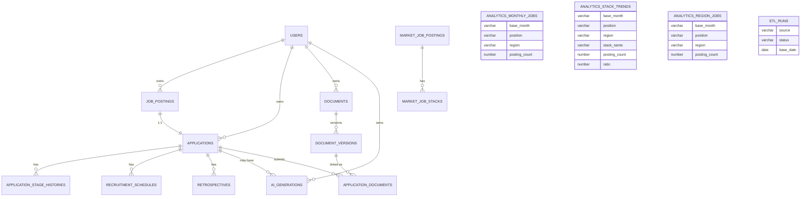

# Plz-Job DB 설계서

**기준 문서:** `docs/plz_job_requirements.md`(§10), `docs/API_명세서.md`(§7 enum), `docs/백엔드 설명.md`(entity/*), `docs/DA_7day_plan.md`(§4 데이터 계약)
**DDL(실행본):** [`db/schema.sql`](../db/schema.sql)
**대상 DB:** Oracle XE 21c · 계정 `plzjob` @ `XEPDB1`

> 이 문서는 네 기준 문서를 하나로 정합시킨 **물리 데이터 모델**이다. 컬럼명·타입·시퀀스는 `백엔드 설명.md`의 JPA 엔티티를 단일 기준으로 삼고, 거기서 다루지 않는 ETL 테이블은 요구사항 §10 + DA 플랜 §4.4로 보강했다.

---

## 1. 설계 범위와 소유권

총 **16개 테이블**. 누가 INSERT/UPDATE 하느냐(쓰기 주체)로 둘로 나뉜다.

| 구분 | 쓰기 주체 | 테이블 |
|---|---|---|
| **서비스 도메인(BE)** | Spring Boot(JPA) | `users`, `job_postings`, `applications`, `application_stage_histories`, `documents`, `document_versions`, `application_documents`, `recruitment_schedules`, `retrospectives`, `ai_generations` |
| **시장·분석(ETL)** | Python ETL | `market_job_postings`, `market_job_stacks`, `analytics_monthly_jobs`, `analytics_stack_trends`, `analytics_region_jobs`, `etl_runs` |

> 🤔 **왜 한 스키마에 같이 두나?** DA 플랜 §2 "Oracle: BE와 동일한 인스턴스·스키마 사용". BE는 시장/분석 테이블을 **읽기 전용**으로만 조회한다(요구사항 §12.2: 원본 HDFS 직접 조회 금지, 집계 테이블만 조회). 즉 `plzjob` 계정 하나에 16개가 공존하고, 쓰기 권한만 운영상 구분한다.

> ✅ **현재 구현 상태(사용 중):** Python ETL(`etl/`)이 사람인 크롤링·태깅·집계 후 `etl/load/oracle_loader.py`로 위 시장·분석 6개 테이블(`market_*`, `analytics_*`, `etl_runs`)에 **직접 적재**한다. Spring Boot의 `MarketService`/`DashboardController`가 이 집계 테이블을 **읽기 전용**으로 조회해 `/api/market/*`로 서빙하고, React 대시보드는 Vite 프록시(`/api` → `localhost:8080`)로 그 실제 백엔드 API를 호출한다. 즉 데이터 흐름은 **ETL → Oracle `analytics_*` → Spring Boot → React**다.
>
> ℹ️ ETL은 같은 집계를 `frontend/src/mocks/data/market.json`으로도 export하지만, 이는 백엔드 없이 프론트를 단독 구동할 때 쓰는 MSW용 오프라인 산출물이며 **현재 실행 앱에서는 MSW를 켜지 않는다**(`main.jsx`에 worker 시작 코드 없음). 현재의 정식 경로는 위 Oracle 경유다.
>
> ⚠️ 현재 `oracle_loader.py`는 집계행을 `position='ALL'`/`region='ALL'` 스코프로만 적재한다. 따라서 `/api/market/*`의 `position`·`region` 필터는 ALL 집계만 반환하며, 직무·지역 드릴다운(§5.2)은 ETL이 세부 스코프를 적재하도록 확장하면 활성화된다.

---

## 2. 공통 설계 규칙

### 2.1 식별자(PK)와 시퀀스
- 모든 PK는 `id NUMBER(19)`, 시퀀스 기반(`@GeneratedValue(SEQUENCE)`).
- 시퀀스 이름은 엔티티 `@SequenceGenerator(sequenceName=...)`와 **1:1로 일치**시켜야 ddl 검증이 깨지지 않는다.
- **INCREMENT BY 규칙**
  - BE 엔티티는 `allocationSize=50` → DB 시퀀스도 `INCREMENT BY 50` (Hibernate pooled optimizer와 일치, ID 충돌·검증오류 방지).
  - ETL 전용 테이블(JPA 엔티티 없음)은 `INCREMENT BY 1` (Python `oracledb`가 `NEXTVAL`로 직접 사용하기 편함).
  - `analytics_stack_trends`/`analytics_region_jobs`는 BE 엔티티(`@SequenceGenerator allocationSize=50`)가 존재하므로 시퀀스도 `INCREMENT BY 50`으로 맞춘다. 실제 적재는 Python ETL(`oracle_loader.py`)이 해당 시퀀스의 `NEXTVAL`로 수행한다(BE는 읽기 전용).

### 2.2 감사 컬럼 + 소프트 삭제
- `BaseEntity`(`@MappedSuperclass`) = `created_at` / `updated_at` / `deleted_at`.
- `deleted_at IS NULL` 조건(`@SQLRestriction`)으로 **소프트 삭제**. 물리 DELETE 대신 `deleted_at` 기록.
- **소프트 삭제 대상(8개):** `users`, `job_postings`, `applications`, `documents`, `document_versions`, `recruitment_schedules`, `retrospectives`, `ai_generations`.
- **이력/연결 테이블은 미적용:** `application_stage_histories`(append-only), `application_documents`(연결행) — `BaseEntity` 미상속.
- ETL 테이블은 `BaseEntity`와 무관(필요한 곳만 `created_at/updated_at` 기본값).

> 🤔 **소프트 삭제라 FK CASCADE를 안 건다.** 부모를 물리 삭제하지 않으니 `ON DELETE CASCADE`가 의미 없다. 부모-자식 정리는 애플리케이션(서비스 트랜잭션)에서 함께 `deleted_at` 처리한다(요구사항 §10.2).

### 2.3 타입 매핑(JPA → Oracle)
| Java | Oracle |
|---|---|
| `Long` | `NUMBER(19)` |
| `String`(length=n) | `VARCHAR2(n)` |
| `@Lob String` | `CLOB` |
| `boolean` | `NUMBER(1)` + `CHECK (col IN (0,1))` |
| `LocalDate` | `DATE` |
| `LocalDateTime` | `TIMESTAMP` |
| `enum`(`EnumType.STRING`) | `VARCHAR2(20~30)` |
| `double`(ratio) | `NUMBER(6,2)` |

### 2.4 데이터 격리(AUTH-06)
사용자 리소스(`job_postings`, `applications`, `documents`, `ai_generations`)는 `user_id`를 가지며, 서비스는 `findByIdAndUser(...)`로 소유권을 검증한다. `application_stage_histories`/`recruitment_schedules`/`retrospectives`/`document_versions`는 부모를 통해 간접 소유(부모 소유권 검증 후 접근).

---

## 3. ERD



> `analytics_*`/`etl_runs`는 다른 테이블과 FK로 연결되지 않는다(ETL이 채우고 BE가 집계값만 읽는 독립 테이블).

---

## 4. 테이블 상세 (서비스 도메인)

### 4.1 `users`  — 소셜 사용자(+프로필)
| 컬럼 | 타입 | 제약 | 설명 |
|---|---|---|---|
| id | NUMBER(19) | PK | `SEQ_USERS` |
| provider | VARCHAR2(20) | NOT NULL | `KAKAO`/`GOOGLE` |
| provider_user_id | VARCHAR2(100) | NOT NULL | 소셜 고유 식별자 |
| email | VARCHAR2(100) | | |
| nickname | VARCHAR2(50) | NOT NULL | |
| desired_position | VARCHAR2(100) | | 희망 직무(프로필) |
| desired_region | VARCHAR2(100) | | 희망 지역 |
| tech_stacks | VARCHAR2(1000) | | 주요 기술스택 **CSV** |
| created_at / updated_at / deleted_at | TIMESTAMP | | 감사·소프트삭제 |
| | | **UNIQUE(provider, provider_user_id)** | AUTH-02 중복 방지 |

### 4.2 `job_postings` — 등록 공고
`user_id`(FK, NOT NULL), `company_name`(NN), `title`(NN), `url`, `position`, `region`, `start_date`, `deadline`, `tech_stacks`(CSV), `description`(CLOB), `favorite`(NUMBER(1) DEFAULT 0). 인덱스: `(user_id)`, `(user_id, url)`(JOB-09 중복검사).

### 4.3 `applications` — 지원 상태
`job_posting_id`(FK, **UNIQUE** = 1:1), `user_id`(FK), `current_stage`(NN, 13종), `applied_at`, `final_result`(NN). 인덱스: `(user_id)`, `(user_id, current_stage)`.

> 🤔 **공고와 지원을 왜 1:1로 나눴나?** 공고=무엇에 지원했나(정적), 지원=지금 어느 단계인가(상태)+이력. MVP는 공고 1건당 지원 1건. 분리해 두면 나중에 "한 공고에 재지원" 같은 확장이 1:N으로 열린다.

### 4.4 `application_stage_histories` — 단계 변경 이력
`application_id`(FK), `from_stage`(NULL 가능=최초), `to_stage`(NN), `changed_at`(NN), `memo`. **append-only**(소프트삭제 없음). 인덱스 `(application_id, changed_at)`.

### 4.5 `documents` / `document_versions` / `application_documents`
- `documents`: `user_id`(FK), `document_type`(NN: `RESUME`/`COVER_LETTER`), `title`(NN).
- `document_versions`: `document_id`(FK), `version_name`(NN), `description`, **파일 메타**(`original_name`, `stored_name`=UUID, `file_path`, `mime_type`, `size_bytes`, `hash`=SHA-256), `extracted_text`(CLOB).
- `application_documents`: `application_id`+`version_id`, **UNIQUE(application_id, version_id)**, 소프트삭제 없음(연결행).

> 🤔 **원본 파일 vs 추출 텍스트(DOC-06).** Oracle에는 메타데이터와 추출 텍스트(`extracted_text` CLOB)만 둔다. 실제 PDF/TXT 원본은 서버 로컬/공유 볼륨에 `stored_name`(UUID)로 저장 — 경로 조작·파일명 충돌 방지.

### 4.6 `recruitment_schedules` / `retrospectives`
- 일정: `application_id`(FK), `schedule_type`(NN: `DEADLINE`/`CODING_TEST`/`INTERVIEW`/`ETC`), `start_at`(NN, TIMESTAMP), `memo`. 인덱스 `(start_at)`로 캘린더 기간 조회.
- 회고: `application_id`(FK), `type`(NN: `CODING_TEST`/`INTERVIEW`), `difficulty`(`EASY`/`NORMAL`/`HARD`), `content`(CLOB NN), `improvement`(CLOB).

### 4.7 `ai_generations` — LLM 결과 이력(AI-09)
`user_id`(FK NN), `application_id`(FK, **NULL 가능** — 대시보드 리포트), `generation_type`(NN: `INTERVIEW_QUESTIONS`/`DASHBOARD_REPORT`), `input_hash`(SHA-256), `response_json`(CLOB NN). 인덱스 `(user_id, application_id, generation_type)`.

---

## 5. 테이블 상세 (시장·분석 — ETL 적재 / BE 읽기 전용) ✅ 현재 사용 중

> 아래 6개 테이블은 §1 주석대로 Python ETL(`etl/load/oracle_loader.py`)이 적재하고 Spring Boot가 `/api/market/*`·대시보드에서 읽기 전용으로 조회한다.

### 5.1 `market_job_postings` / `market_job_stacks`
- 공고: `(source, external_id)` **UNIQUE**(멱등 키, ETL-08). `external_id`는 외부 ID 또는 정규화 URL의 SHA-256. 표준 컬럼: `position`, `region`(=표준 시·도), `sigungu`, `posted_date`, `deadline`, `base_date`.
- 스택: `market_job_id`(FK) + `stack_name`, **UNIQUE(market_job_id, stack_name)**, `matched_keyword`.

> 🤔 **개인 공고는 CSV, 시장 공고는 정규화 테이블 — 왜 다르게?** 개인 `job_postings.tech_stacks`는 표시용이라 비정규화 CSV로 충분하다. 반면 시장 데이터는 "스택별 공고 수"를 **집계**해야 하므로 `market_job_stacks`로 정규화해 `GROUP BY stack_name`이 가능해야 한다. 용도(표시 vs 집계)가 정규화 수준을 결정한다.

### 5.2 `analytics_monthly_jobs` / `analytics_stack_trends` / `analytics_region_jobs`
DA 플랜 **§4.4 권장안 채택** — 세 집계 테이블 모두 `position`·`region` 필터 컬럼 + 복합 UNIQUE.

| 테이블 | 컬럼 | UNIQUE |
|---|---|---|
| analytics_monthly_jobs | base_month, position, region, posting_count | (base_month, position, region) |
| analytics_stack_trends | base_month, position, region, stack_name, posting_count, ratio | (base_month, position, region, stack_name) |
| analytics_region_jobs | base_month, position, region, **sigungu**, posting_count | (base_month, position, region, sigungu) |

- `base_month` = `'YYYY-MM'`. `ratio`(%)는 분모 0이면 **NULL**(요구사항 §7.5·DA §4.3 "데이터 부족").
- **`analytics_region_jobs`의 `sigungu`(지역 드릴다운):** 별도 테이블 대신 `region_jobs`에 `sigungu` 컬럼을 추가. `sigungu='ALL'` 행 = 시·도 합계(필터 미지정 시 조회), 실제 `sigungu` = 구 단위. `region`(시·도)은 실제값만(ALL 없음). 단일 테이블이 SSOT이며 중복 저장이 없다.
- **`'ALL'` 센티넬:** "전체"(직무·지역·시군구 무관) 집계행은 `position`/`region`/`sigungu`를 `NULL`이 아니라 `'ALL'`로 넣는다. → Oracle은 복합 UNIQUE에서 NULL을 서로 다른 값으로 취급해 중복 차단이 안 되기 때문. BE는 필터 미지정 시 `= 'ALL'` 행을 조회한다. **시·도 분포 조회 시 반드시 `AND sigungu='ALL'`** (없으면 구 단위 행까지 합산돼 중복).

> ⚠️ **엔티티-DDL 부분 불일치(잔여 항목).** 현재 BE 엔티티 기준: `AnalyticsRegionJob`에는 `sigungu`가 추가됐지만 `position`이 아직 없고, `AnalyticsStackTrend`에는 `region`이 아직 없다(본 DDL에는 둘 다 있음, `DEFAULT 'ALL'`). 그래서 `MarketService`는 stack-trends를 `position` 기준으로만 필터하고 region-distribution은 `sigungu='ALL'` 행만 조회한다(§1의 "ALL 스코프만 적재"와 정합). API의 `stack-trends?region=`·`region-distribution?position=` 드릴다운을 켜려면 두 엔티티에 해당 필드를 추가하고 ETL이 세부 스코프를 적재하면 된다. 본 DDL이 그 목표 최종형이다.

### 5.3 `etl_runs` — 실행 이력(ETL-07·10)
`source`, `started_at`(NN), `ended_at`, `status`(`RUNNING`/`SUCCESS`/`FAILED`), `extracted_count`, `loaded_count`, `base_date`, `error_message`. 인덱스 `(status, started_at DESC)`. → BE는 **최신 SUCCESS의 `base_date`**를 대시보드 `dataBaseDate`로 노출(ETL-10).

---

## 6. 요구사항 §10과의 차이(의도적 결정)

| 요구사항 §10 | 본 설계 | 이유 |
|---|---|---|
| `user_profiles` 분리 테이블 | `users`에 통합(`desired_*`, `tech_stacks`) | 1:1 + 컬럼 4개. MVP는 통합이 단순. 필요 시 `@OneToOne` 분리 가능 |
| `job_posting_stacks` 분리 테이블 | `job_postings.tech_stacks` CSV 컬럼 | 개인 공고 스택은 **표시용**이라 비정규화. 집계 대상 아님 |
| analytics 테이블에 필터 컬럼 없음 | `position`·`region` 포함(+`'ALL'`) | API 필터 정합(DA §4.4 권장안) |

나머지(테이블 목록, 소셜 UNIQUE, `(source, external_id)` 멱등, 소프트삭제, 생성/수정일)는 §10을 그대로 따른다.

---

## 7. 적용 방법

### DBeaver / sqlplus (plzjob 계정)
```sql
-- DBeaver: db/schema.sql 열고 전체 실행(Alt+X)
-- 또는 sqlplus:
--   sqlplus plzjob/플라이그_DB_PASSWORD@localhost:1522/XEPDB1 @db/schema.sql
SELECT table_name FROM user_tables ORDER BY 1;   -- 16개 확인
```

### JPA `ddl-auto`와의 관계
- `application.yaml`은 학습용 `ddl-auto: update`. 빈 스키마에서 BE를 기동하면 **BE가 매핑한 엔티티(서비스 도메인 10종 + analytics 2종)가 자동 생성**되지만, JPA 엔티티가 없는 `market_*`/`analytics_monthly_jobs`/`etl_runs`는 생성되지 않는다.
- 따라서 **ETL 적재 전에 `db/schema.sql`을 한 번 실행**해 16종 전체를 만들어 두어야 한다. ETL(`oracle_loader.py`)이 `market_*`·`analytics_*`·`etl_runs`를 채우고, BE가 이를 조회한다(§1·§5). 시장/대시보드 화면이 동작하려면 이 6종이 채워져 있어야 한다.
- 운영 지향이면 `ddl-auto: validate` + 본 DDL을 형상관리(Flyway 등)하는 방식으로 전환한다.

---

## 8. 검증 체크리스트

### 스키마·서비스 도메인
- [ ] `db/schema.sql` 무오류 실행, `user_tables` 16개.
- [ ] `user_sequences` 16개(BE 10 + analytics 2 @50 / ETL 4 @1).
- [ ] `uq_user_social`, `uq_applications_job` 존재.
- [ ] BE 기동(`ddl-auto: update`) 시 엔티티-테이블 매핑 오류 없음.

### 시장·분석(ETL → Oracle → BE)
- [ ] `uq_market_job`, analytics 복합 UNIQUE 4종 존재.
- [ ] `etl/run.py` 실행 후 `market_*`/`analytics_*`/`etl_runs`에 행이 적재됨.
- [ ] `/api/market/stack-trends`·`/region-distribution`·`/user-comparison` 가 적재값을 반환(빈 테이블이면 빈 차트).
- [ ] `etl_runs` 최신 `SUCCESS`의 `base_date`가 대시보드 `dataBaseDate`로 노출(ETL-10).

### 잔여(드릴다운 확장 시, §5.2 ⚠️)
- [ ] `AnalyticsStackTrend.region`, `AnalyticsRegionJob.position` 엔티티 추가 + ETL 세부 스코프 적재.
